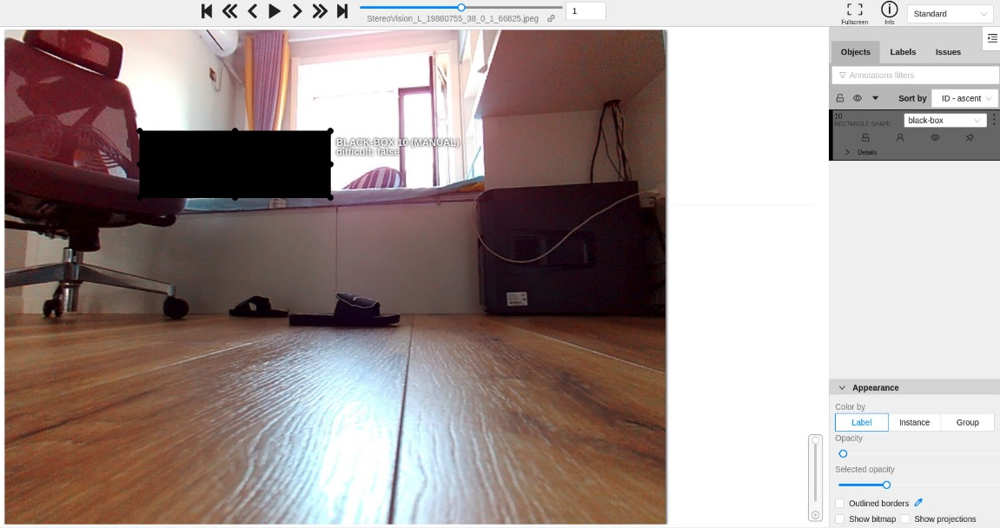

- [User's guide](#users-guide)
  - [Official document](#official-document)
  - [Roborock internal requirements](#roborock-internal-requirements)

# User's guide

Computer Vision Annotation Tool (CVAT) is a web-based tool which helps to
annotate videos and images for Computer Vision algorithms. It was inspired
by [Vatic](http://carlvondrick.com/vatic/) free, online, interactive video
annotation tool. CVAT has many powerful features: _interpolation of bounding
boxes between key frames, automatic annotation using deep learning models,
shortcuts for most of critical actions, dashboard with a list of annotation
tasks, LDAP and basic authorization, etc..._ It was created for and used by
a professional data annotation team. UX and UI were optimized especially for
computer vision tasks developed by our team.

## Official Document

https://openvinotoolkit.github.io/cvat/docs/<br>
Note that some features in the document are not included in the current version.

## Roborock internal requirements

#### 特殊含义标签：

black-box: 涂黑敏感信息
元数据：
```
[
  {
    "name": "black-box",
    "color": "#000000",
    "attributes": []
  }
]
```
标注效果：


#### 合并同一个Project下Tasks:

在project详情页下发起创建Task，切换到**completed tasks**，这里会显示当前Project中状态是**Completed**的Tasks的ID。
合并后的Task会包含原有Tasks的图片以及Shapes和Tags的标注。
合并的Tasks会在图片前加上前缀**taskID__**。


#### 标注机
白光34类：yolov5l<br>
红外34类：yolov5l<br>
<br>


#### 修改Task的Owner

完成标注后，可以把owner修改成admin来锁定任务。<br>


#### 导出Project的标注统计结果

在项目列表或者项目详情页面的Actions中Download Stats来导出excel表格。
项目中每个Task的统计分Sheet写入。

<br>
<br>
<br>


#### 创建Task时，选择摄像头标签。

<br>
