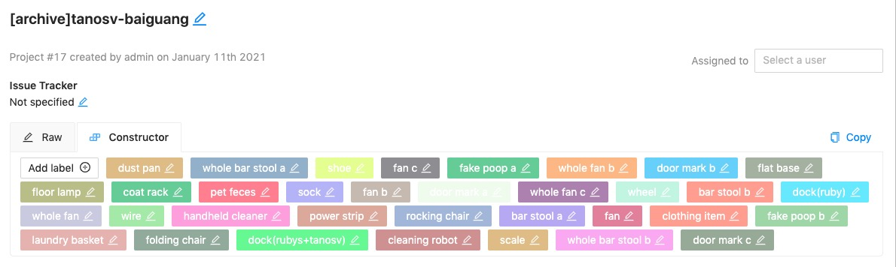
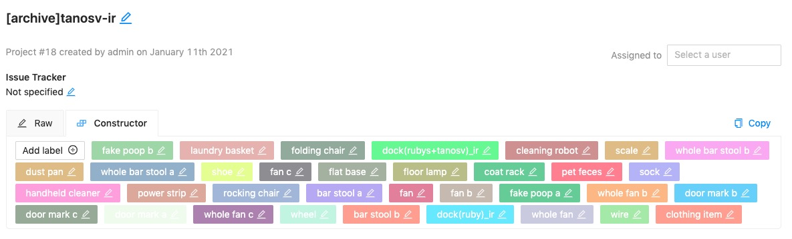
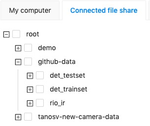
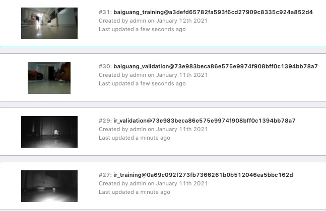
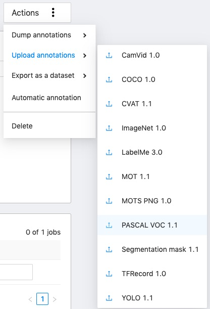

## Prepare dataset

For TanosV object detection dataset
- baiguang training: https://github.com/RockRobo/det_trainset
- baiguang validation: https://github.com/RockRobo/det_testset/tree/master/neice_final
- ir training: https://github.com/RockRobo/rio_ir
- ir validation: https://github.com/RockRobo/det_testset/tree/master/shtest_ir

download to cvat backend disk: ./assets/roborock_data/github-data

### Create project

- [baiguang labels](./assets/baiguang-labels.json)
- 
- [ir labels](./assets/ir-labels.json)
- 

### Create task

create task with project link and upload data from "Connected file share"


the created tasks as:

### upload annotations

fetch annotations
```
cd ./annotations
scp -r roborock@192.168.50.120:./roborock_data/github-data/det_trainset/VOC2007/Annotations baiguang-training/origin
scp -r roborock@192.168.50.120:./roborock_data/github-data/det_testset/neice_final/VOC2007/Annotations baiguang-validation/origin
scp -r roborock@192.168.50.120:./roborock_data/github-data/det_testset/shtest_ir/VOC2007/Annotations ir-validation/origin
scp -r roborock@192.168.50.120:./roborock_data/github-data/rio_ir/VOC2007/Annotations ir-training/origin
```

filter objects with unknwon labels
```
python filter.py \
  --input_dir=./annotations/baiguang-training/origin \
  --output_dir=./annotations/baiguang-training/Annotations \
  --label_path=./assets/baiguang-labels.json
ls ./annotations/baiguang-training/origin  | wc
ls ./annotations/baiguang-training/Annotations  | wc

python filter.py \
  --input_dir=./annotations/baiguang-validation/origin \
  --output_dir=./annotations/baiguang-validation/Annotations \
  --label_path=./assets/baiguang-labels.json
ls ./annotations/baiguang-validation/origin | wc
ls ./annotations/baiguang-validation/Annotations | wc

python filter.py \
  --input_dir=./annotations/ir-training/origin \
  --output_dir=./annotations/ir-training/Annotations \
  --label_path=./assets/ir-labels.json
ls ./annotations/ir-training/origin | wc
ls ./annotations/ir-training/Annotations | wc

python filter.py \
  --input_dir=./annotations/ir-validation/origin \
  --output_dir=./annotations/ir-validation/Annotations \
  --label_path=./assets/ir-labels.json
ls ./annotations/ir-validation/origin | wc
ls ./annotations/ir-validation/Annotations | wc
```

compress and upload
```
cd ./annotations
zip -r baiguang-training.zip baiguang-training/Annotations
zip -r baiguang-validation.zip baiguang-validation/Annotations
zip -r ir-training.zip ir-training/Annotations
zip -r ir-validation.zip ir-validation/Annotations
```

